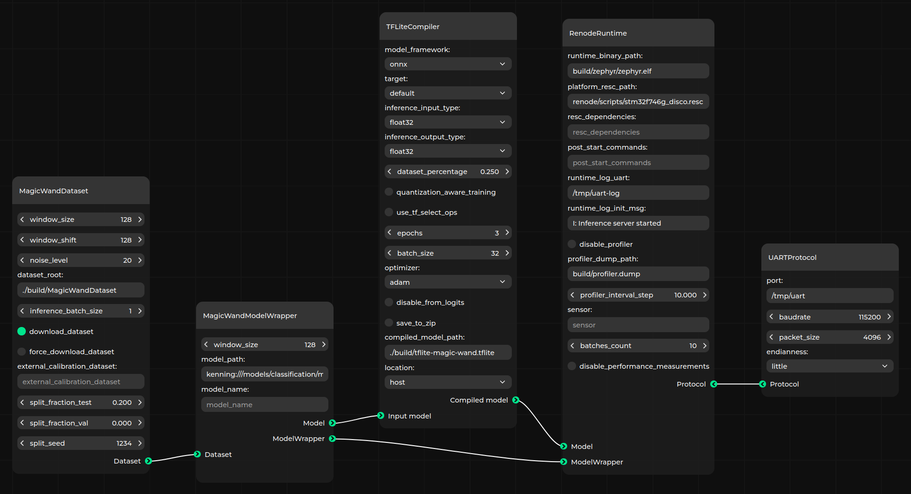
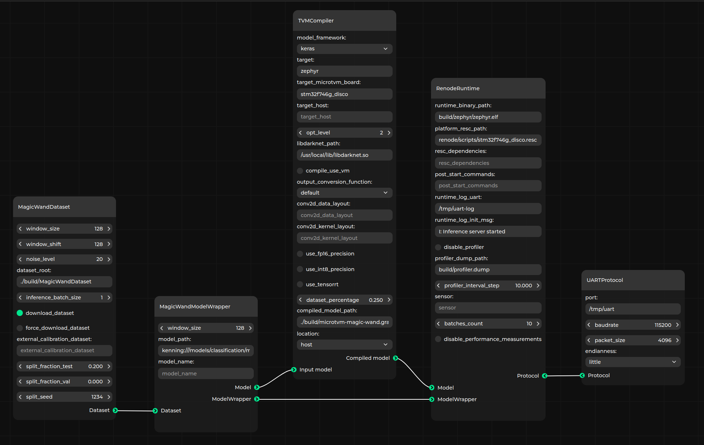

# Evaluating models on hardware using Kenning Zephyr Runtime

This section contains tutorial of evaluating models on microcontrollers using [Kenning Zephyr Runtime](https://github.com/antmicro/kenning-zephyr-runtime) and [Renode](https://renode.io/).

## Preparing the Zephyr environment

First, we need to setup environment for building the runtime.
Start with installing dependencies:

* [Zephyr dependencies](https://docs.zephyrproject.org/latest/develop/getting_started/index.html#install-dependencies)
* `jq`
* `curl`
* `west`
* `CMake`

On Debian-based Linux distributions, the above-listed dependencies can be installed as follows:

```bash
apt update
apt install -y --no-install-recommends ccache curl device-tree-compiler dfu-util file \
  g++-multilib gcc gcc-multilib git jq libmagic1 libsdl2-dev make ninja-build \
  python3-dev python3-pip python3-setuptools python3-tk python3-wheel python3-venv \
  mono-complete wget xz-utils
```

Next, create a Zephyr workspace directory and clone there Kenning Zephyr Runtime repository:
```bash
mkdir -p zephyr-workspace && cd zephyr-workspace
git clone https://github.com/antmicro/kenning-zephyr-runtime
cd kenning-zephyr-runtime
```

Now create Python's virtual environment and install [west](https://github.com/zephyrproject-rtos/west) - Zephyr's command line tool:
```bash
python3 -m venv venv
source venv/bin/activate
pip install west cmake
```

Then, initialize Zephyr workspace and ensure that latest Zephyr SDK is installed:

```bash
./scripts/prepare_zephyr_env.sh
```

Finally, prepare additional modules:

```bash
./scripts/prepare_modules.sh
```

## Installing Kenning with Renode support

Evaluating models using Kenning Zephyr Runtime requires [Kenning](https://github.com/antmicro/kenning) with Renode support.
Use `pip` to install it:

```bash
pip install --upgrade pip
pip install "kenning[tvm,tensorflow,reports,renode] @ git+https://github.com/antmicro/kenning.git"
```

To use Renode, either follow [Renode documentation](https://renode.readthedocs.io/en/latest/introduction/installing.html) or download a package for Renode and set `PYRENODE_ARCH_PKG` variable for [pyrenode3](https://github.com/antmicro/pyrenode3) package:

```bash
wget https://builds.renode.io/renode-latest.pkg.tar.xz
export PYRENODE_ARCH_PKG=$(realpath renode-latest.pkg.tar.xz)
```

## Building and evaluating Magic Wand model using TFLite backend



Let's build the Kenning Zephyr Runtime with [TFLiteMicro](https://github.com/tensorflow/tflite-micro) as model executor for `stm32f746g_disco` board.
Run:

```bash
west build --board stm32f746g_disco app -- -DEXTRA_CONF_FILE=tflite.conf
```

The built binary can be found in `build/zephyr/zephyr.elf`.

To evaluate the Magic Wand model using built runtime, run:
```bash
kenning optimize test \
    --json-cfg kenning-scenarios/renode-zephyr-tflite-magic-wand-inference.json \
    --measurements build/zephyr-stm32-tflite-magic-wand.json --verbosity INFO \
    --verbosity INFO
```

The evaluation results would be saved at `build/zephyr-stm32-tflite-magic-wand.json`.

## Building and evaluating Magic Wand model using microTVM backend



Building the Kenning Zephyr Runtime with [microTVM](https://tvm.apache.org/docs/topic/microtvm/index.html) support for the same board requires changing only `-DEXTRA_CONF_FILE` value.
Run:

```bash
west build --board stm32f746g_disco app -- -DEXTRA_CONF_FILE=tvm.conf
```

And now, as previously, run evaluation using Kenning:
```bash
kenning optimize test \
    --json-cfg kenning-scenarios/renode-zephyr-tvm-magic-wand-inference.json \
    --measurements build/zephyr-stm32-tvm-magic-wand.json --verbosity INFO \
    --verbosity INFO
```

The evaluation results would be saved at `zephyr-stm32-tvm-magic-wand.json`.

## Comparing the results

To generate comparison report run:

```bash
kenning report \
    --measurements \
      build/zephyr-stm32-tflite-magic-wand.json \
      build/zephyr-stm32-tvm-magic-wand.json \
    --report-path build/zephyr-stm32-tflite-tvm-comparison.md \
    --report-types renode_stats performance classification \
    --to-html
```

The HTML version of the report should be saved at `build/zephyr-stm32-tflite-tvm-comparison/zephyr-stm32-tflite-tvm-comparison.html`.
