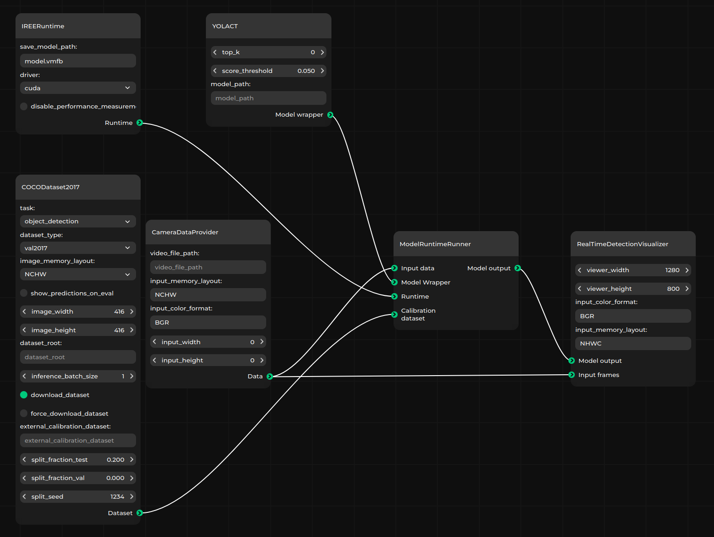

# Visualizing Kenning data flows with Pipeline Manager

[Pipeline Manager](https://github.com/antmicro/kenning-pipeline-manager) is a 
GUI tool that helps visualize and edit data flows. 

This chapter describes how to setup and use the manager with Kenning's graphs

Pipeline Manager is application-agnostic, and does not assume any 
properties of the application it is working with. Though, Kenning implements a  PM client which 
provides tools for creating complex Kenning pipelines and flows, while also 
allowing for running and saving these configurations directly from the editor.    


## Installing Pipeline Manager

Kenning requires extra dependencies to run integration with Pipeline Manager. To install them run:

```bash
pip install "kenning[pipeline_manager] @ git+https://github.com/antmicro/kenning.git"
```

To use Pipeline Manager, clone the repository and install its dependencies:

```bash
git clone https://github.com/antmicro/kenning-pipeline-manager.git
cd kenning-pipeline-manager
pip install -r requirements.txt
```

And follow installation requirements present in [Pipeline Manager README](https://github.com/antmicro/kenning-pipeline-manager).

After this, build the server application for Pipeline Manager with:

```bash
./build server-app
```

## Running Pipeline Manager with Kenning

Firstly, in the Pipeline Manager project start the server with:

```bash timeout=10
./run
```

The server now waits for Kenning application to connect.

```
INFO:root:Waiting for connection from third-party application on 127.0.0.1, port 9000
INFO:root:Server was initialized
INFO:root:Connect the application to run start.
INFO:root:Server is listening on 127.0.0.1:9000
```

Secondly, start the Kenning pipeline manager client with:

```bash
kenning visual-editor -h
```

The `--file-path` option specifies where the results of model benchmarking will be stored or flow's runtime data.

Where the other possible, optional arguments are:

* `--spec-type` - the type of Kenning scenarios to run, can be either `pipeline` (for [optimization and deployment pipeline](../json-scenarios)) or `flow` (for creating [runtime scenarios](../kenning-flow)).
  By default it is `pipeline`
* `--host` - the address of the Pipeline Manager server, default `127.0.0.1`
* `--port` - the port of the Pipeline Manager server, default `9000`
* `--verbosity` - verbosity of the logs

## Using Pipeline Manager

With the default configuration, the web application is available under `http://127.0.0.1:5000/` 



This can be an example workflow when using Pipeline Manager:

* `Load File` - Menu option available in the top left, loads a JSON configuration describing a Kenning scenario. 

  For instance, `scripts/jsonconfigs/sample-tflite-pipeline.json` available in 
  Kenning is a basic configuration shown as an [Example use case of Kenning - benchmarking using a native framework](tflite_tvm.md#benchmarking-a-model-using-a-native-framework)

* Making changes - adding or removing nodes, editing connections, node options, etc.
* `Validate` -  Validates and returns the information whether the scenario is valid (for example it will return error when two optimizers in the chain are incompatible with each other)
* `Run` - Creates and runs the optimization pipeline or [Kenning runtime flow](../kenning-flow).
* `Save file` - Saves the JSON scenario of Kenning to a specified path.

More information regarding information how to work with Pipeline Manager are available in the [Pipeline Manager documentation](https://antmicro.github.io/kenning-pipeline-manager/introduction.html)
