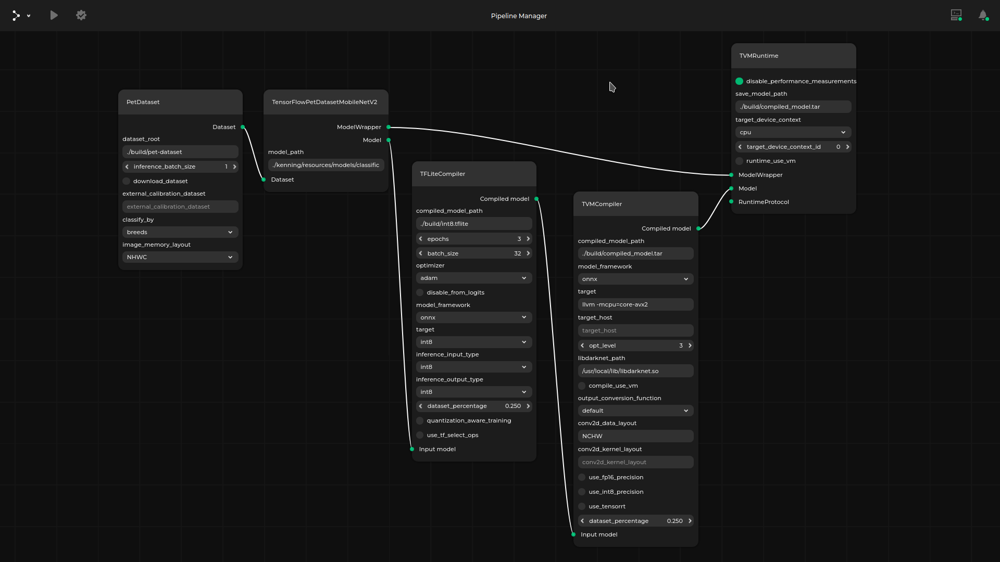

# Visualizing Kenning data flows with Pipeline Manager

[Pipeline Manager](https://github.com/antmicro/kenning-pipeline-manager) is a GUI tool that helps visualize and edit data flows.

This chapter describes how to set up Pipeline Manager and use it with Kenning graphs.

Pipeline Manager is application-agnostic and does not assume any properties of the application it is working with. 
Kenning, however, implements a Pipeline Manager client which provides tools for creating complex Kenning pipelines and flows, while also allowing for running and saving these configurations directly from Pipeline Manager's editor.



## Installing Pipeline Manager

Kenning requires extra dependencies in order to run the Pipeline Manager integration.
To install them, run:

```bash
pip install "kenning[pipeline_manager] @ git+https://github.com/antmicro/kenning.git"
```

## Running Pipeline Manager with Kenning

Start the Pipeline Manager client with:

```bash timeout=10
kenning visual-editor --file-path measurements.json --workspace-dir ./workspace
```

The `--file-path` option specifies where the results of model benchmarking or the runtime data will be stored.

For runtime data, the following arguments are available:

* `--spec-type` - type of Kenning scenario to be run, can be either `pipeline` (for [optimization and deployment pipeline](../json-scenarios)) or `flow` (for creating [runtime scenarios](../kenning-flow)).
`pipeline` is the default type.
* `--host` - Pipeline Manager server address, default: `127.0.0.1`
* `--port` - Pipeline Manager server port, default: `9000`
* `--verbosity` - log verbosity

## Using Pipeline Manager

In its default configuration, the web application is available under `http://127.0.0.1:5000/`.


Below, you can find an example Pipeline Manager workflow:

* `Load File` - option available from the drop-down menu on the top left, loads a JSON configuration describing a Kenning scenario.

  For instance, `scripts/jsonconfigs/sample-tflite-pipeline.json` available in Kenning is a basic configuration for an [ Kenning example use case for benchmarking using a native framework](./tflite_tvm.md#benchmarking-a-model-using-a-native-framework).

* Graph editing - adding or removing nodes, editing connections, node options, etc.
* `Validate` -  validates and returns the information whether the scenario is valid.

  For example, it will return an error when two optimizers in a chain are incompatible with each other.

* `Run` - creates and runs the optimization pipeline or [Kenning runtime flow](../kenning-flow).
* `Save file` - saves current JSON scenario to a specified path.

More information about how to work with Pipeline Manager is available in the [Pipeline Manager documentation](https://antmicro.github.io/kenning-pipeline-manager/introduction.html).
